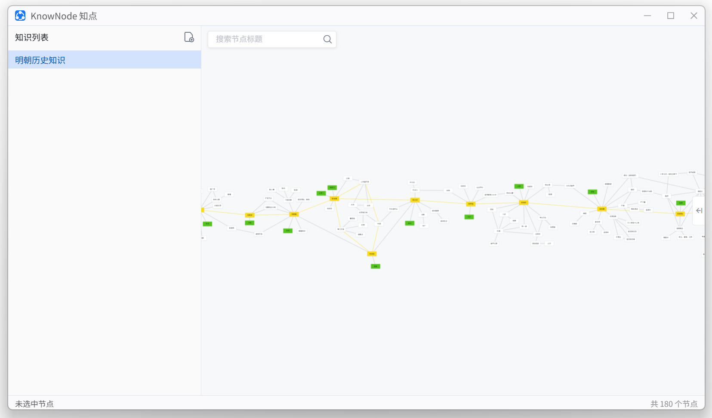

# KnowNode 知点

**节点化个人知识管理工具。**

人脑海里的知识不是分门别类的目录树，而是一张网：最小单位是一个**知识节点**，节点与节点之间有**关联**，众多节点通过关联织成一张知识网络。KnowNode 就是以这种形式管理知识的。

- KnowNode 内所有内容都保存在**本机**，不依赖网络。
- 编译产物仅一个 exe 文件，3.8 MB
- 下载地址：[https://github.com/xland/KnowNode](https://github.com/xland/KnowNode)

### 知识节点

| 操作         | 做法                                                                                    |
| ------------ | --------------------------------------------------------------------------------------- |
| 新建节点     | 在画布**空白处右键 → 新建知识节点**，节点就落在右键的那个位置                           |
| 新建关联节点 | 选中节点，右侧的 **＋** 按钮，或按 **Tab** —— 新节点出现在它右边，随即进入知识标题编辑  |
| 改标题       | **双击节点**就地改（回车 / 失焦提交）。标题最多 **36 个字符**，空白的会显示成「未命名」 |
| 摆放         | **拖拽节点**（中间大部分区域），位置会自动入库                                          |
| 标记色       | **右键节点**，弹出颜色选择器。点一个就着色                                              |
| 删除         | 选中知识节点后按 **Del**，或 **右键节点 → 删除节点**；多选时删整批                      |
| 写详情       | 单击节点选中它，详细内容面板里可以给**这条关联**写内容                                  |

### 知识关联

| 操作     | 做法                                                                         |
| -------- | ---------------------------------------------------------------------------- |
| 连一条线 | 从**节点的边缘**往外拖，拖到另一个节点上松手；**在空白处松手 = 取消**        |
| 标记色   | 右键连线，同样会出现颜色选择器                                               |
| 删除     | 选中连线后按 **Del**，或 **右键连线 → 删除连线**。删节点时它的连线跟着一起删 |
| 写详情   | 单击连线选中它，详细内容面板里可以给**这条关联**写内容                       |

### 选中与多选

- **单击节点** = 只选它一个；**单击空白处** = 取消选中。
- **Ctrl + 单击节点** = 加选 / 取消这一个（多选的第二种方式）。
- 在空白处**按住拖出一个框** = 框选，与框交叠的节点一起选中（擦到一点就算）。
- 多选之后：拖其中一个，**整批一起移动**；按 **Del** 或右键删除，**整批一起删**。

### 查找知识

| 想做什么     | 怎么做                                                                     |
| ------------ | -------------------------------------------------------------------------- |
| 缩放         | **Ctrl + 滚轮**（以鼠标位置为锚点，光标下那个点不动）                      |
| 上下移动画布 | 直接**滚动鼠标滚轮**（就是滚动条的用法）                                   |
| 平移画布     | 按住 **Ctrl** 或 **空格** 再拖空白处；                                     |
| 搜索节点     | 左上角搜索框输入标题后**回车**：命中的第一个节点会被**摆到视口正中并选中** |

---

## 详细内容（右栏，可收起）

一个富文本编辑区，内容随当前选中的对象变：

| 当前对象               | 面板内容               |
| ---------------------- | ---------------------- |
| 选中（单个）节点       | 这个知识点的详情       |
| 选中连线               | 这条关联的详情         |
| 没选中 / 多选 / 点空白 | **这个知识整体**的描述 |

- **编辑即存**，不用点保存；关面板、切换知识时会先把没写完的内容落盘，不丢字。
- **图片**：直接粘贴或拖进编辑区即可，会自动存到本机数据目录
